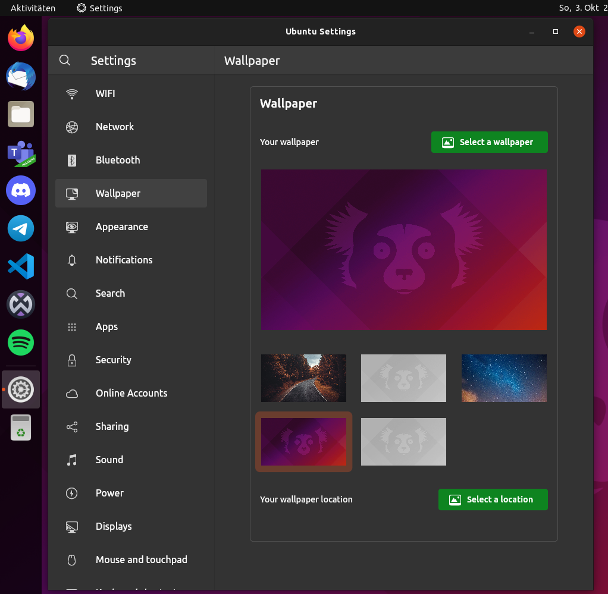
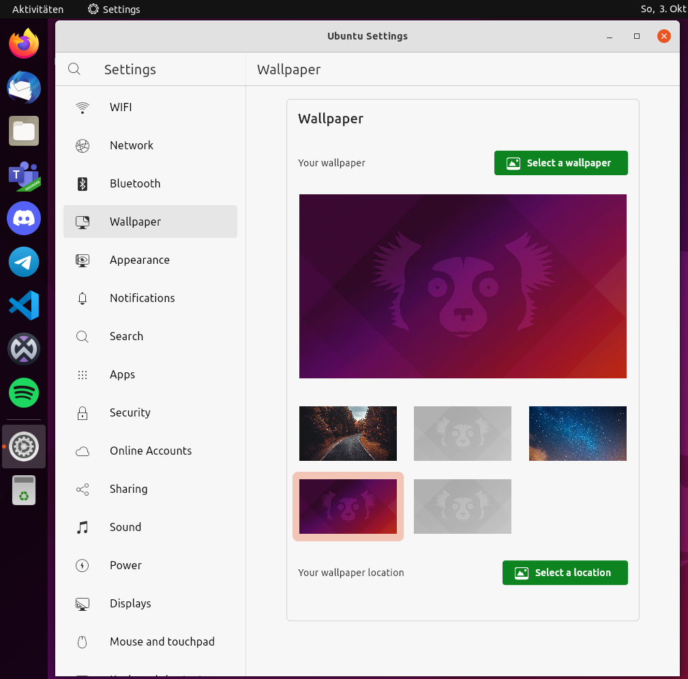
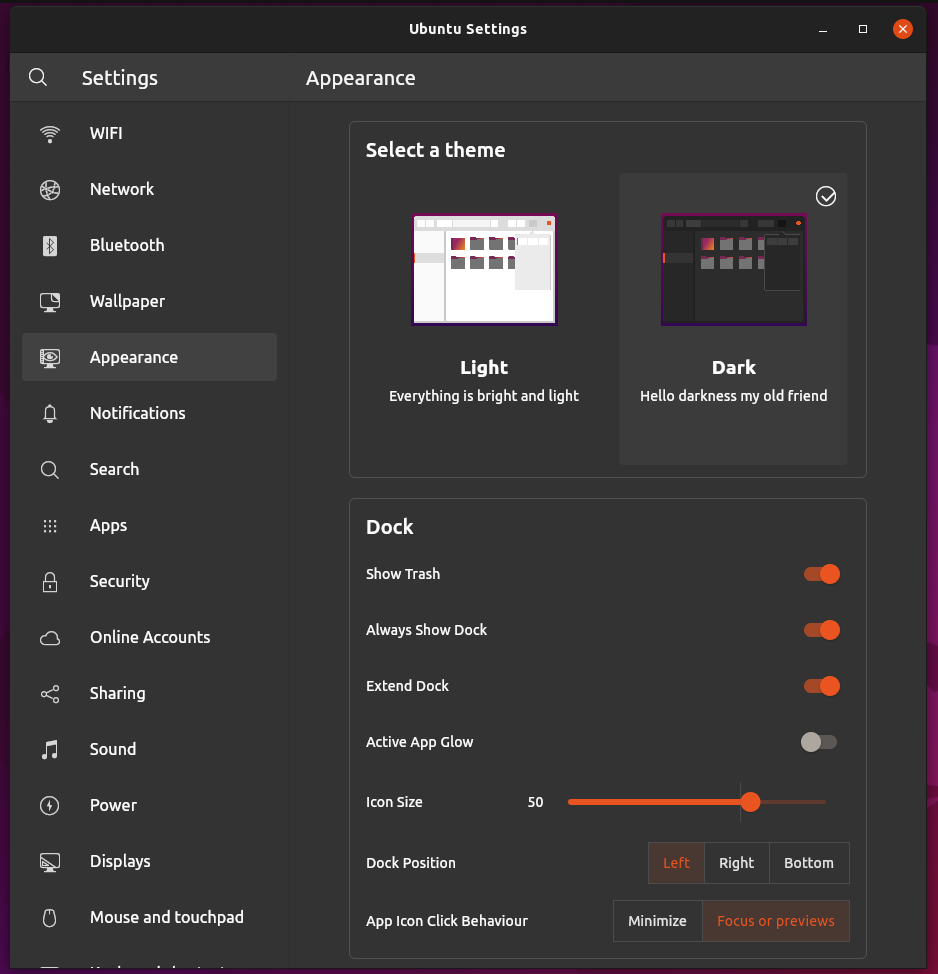
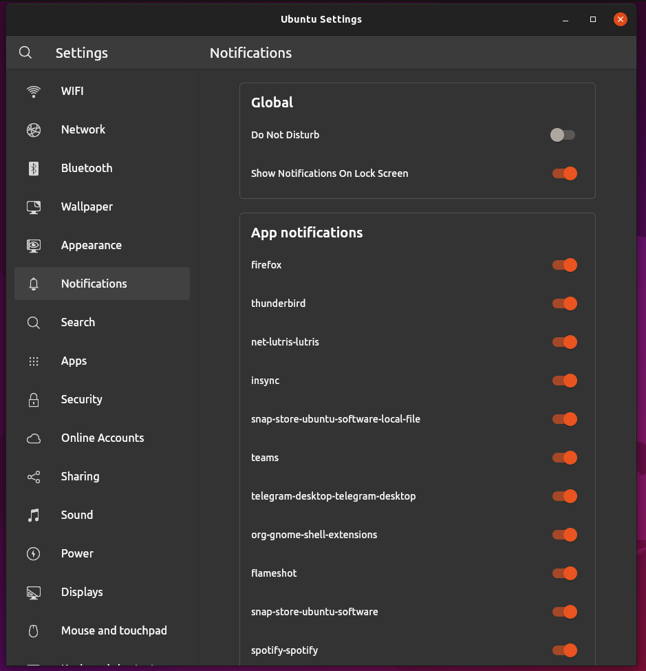
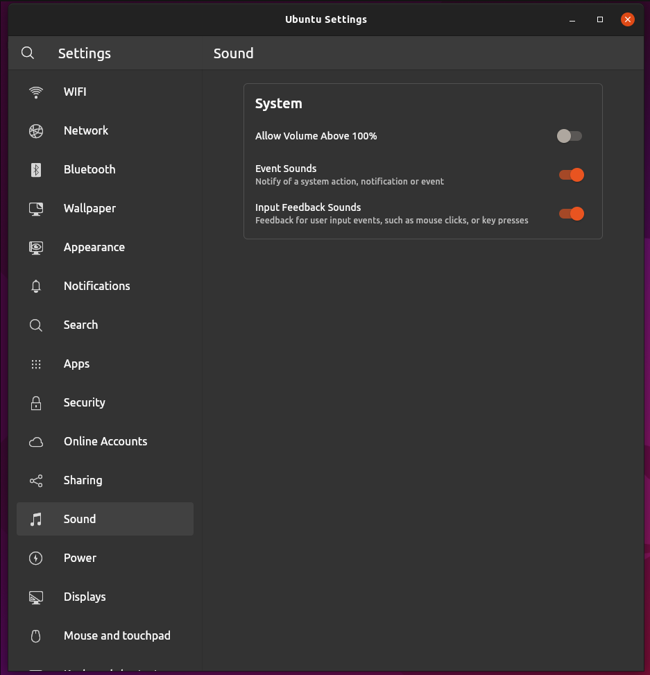
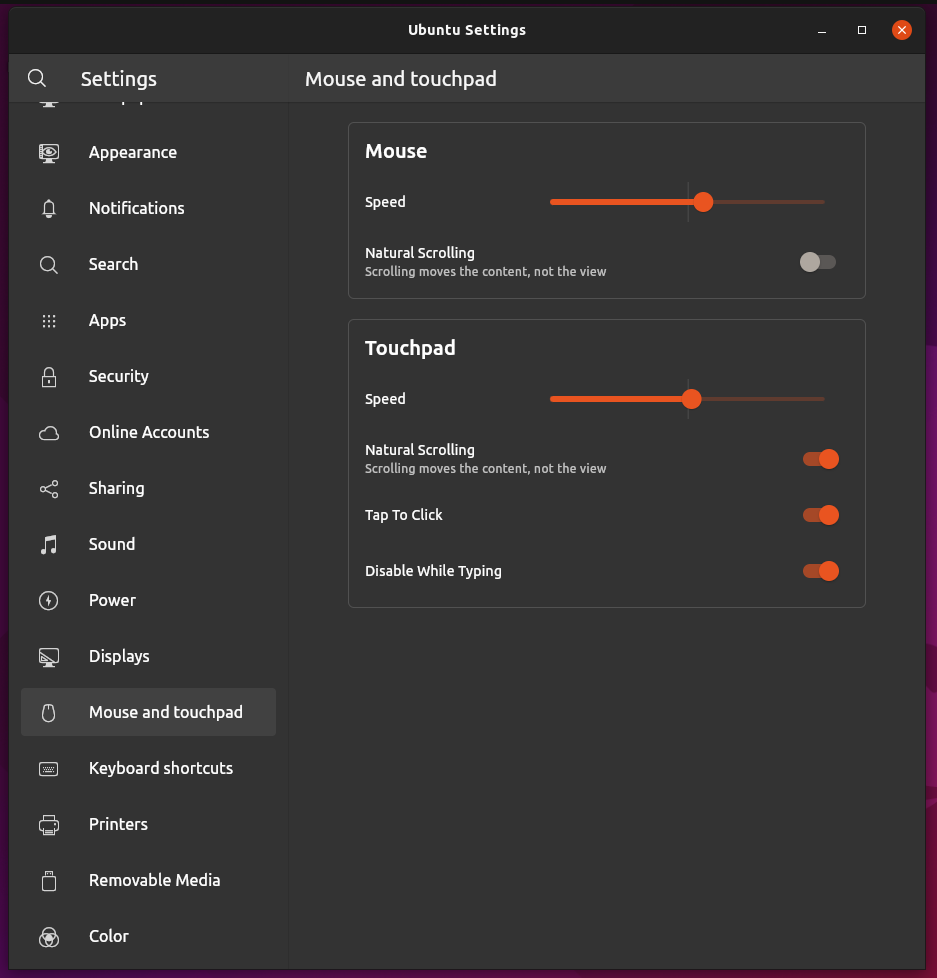
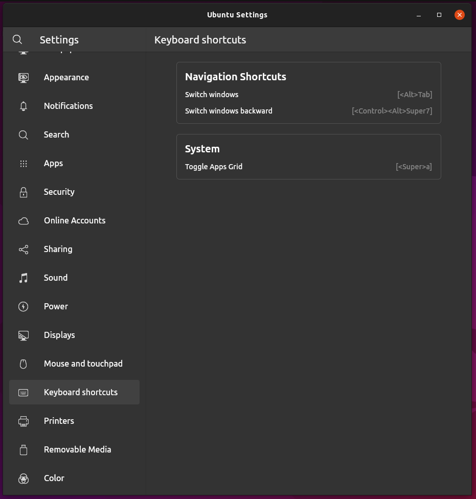
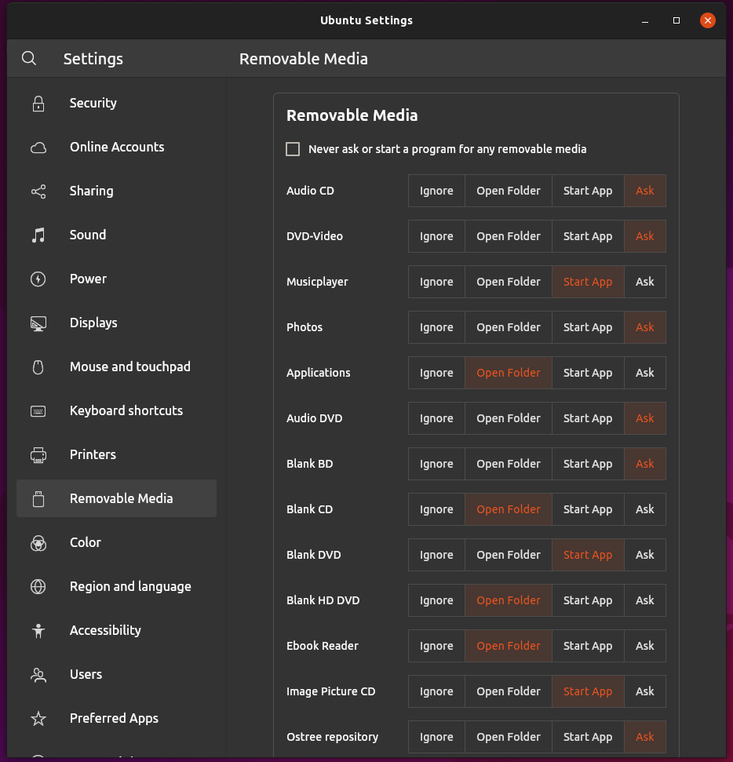
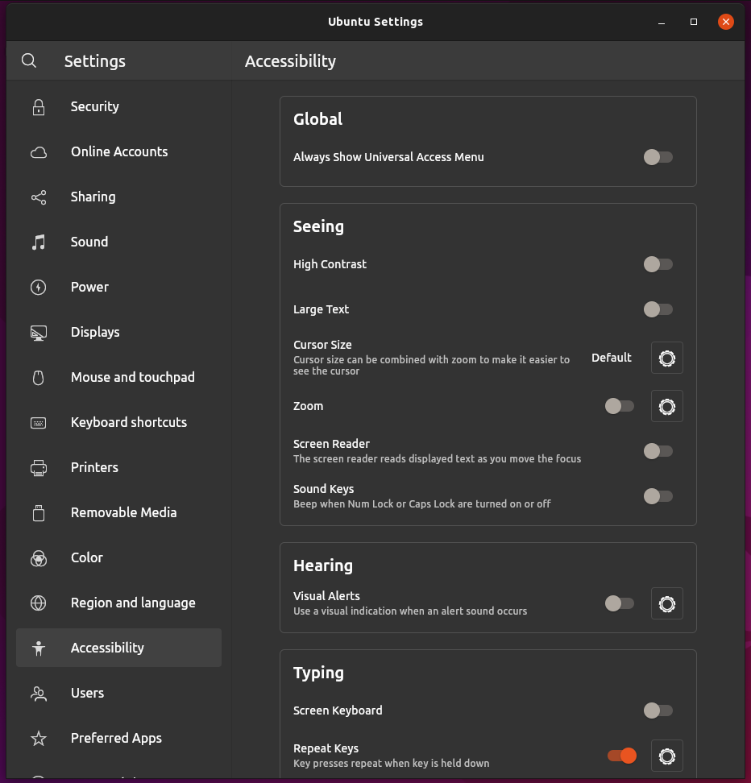
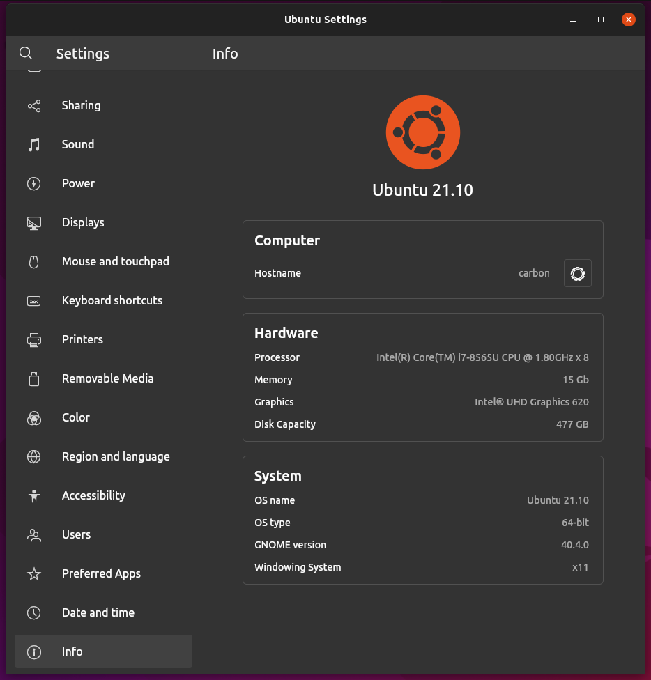

# Unofficial Ubuntu Desktop Settings App made with Flutter - WIP

The goal of this project is to build a feature complete settings app for the Ubuntu desktop with the Flutter UI toolkit.

Packages that we already use or plan to use are:

- [gsettings.dart](https://github.com/canonical/gsettings.dart)
- [bluez.dart](https://github.com/canonical/bluez.dart)
- [nm.dart](https://github.com/canonical/nm.dart)
- [yaru.dart](https://github.com/ubuntu/yaru.dart)
- [dbus.dart](https://github.com/canonical/dbus.dart)
- [upower.dart](https://github.com/canonical/upower.dart)

# TODO

- [X] use real yaru icons - thanks to @Jupi007
- [X] responsive layout
- [X] [MVVM software architecture](https://en.wikipedia.org/wiki/Model%E2%80%93view%E2%80%93viewmodel)
- [X] search
- [ ] WIFI page
- [ ] Network page
- [ ] Bluetooth page
- [X] Wallpaper page

    
    

- [X] Appearance page

    

- [X] Notifications page

    

- [ ] Search page
- [ ] Apps page
- [ ] Security page
- [ ] Online Accounts page
- [ ] Sharing page
- [ ] Sound page - WIP

    
    
- [ ] Energy page
- [ ] Displays page
- [X] Mouse and touchpad page

    

- [ ] Keyboard shortcuts page - WIP

    

- [ ] Printers page
- [X] Removeable Media page

    
    
- [ ] Color page
- [ ] Region and language page
- [X] Accessability page

    

- [ ] Users page
- [ ] Preferred apps page
- [ ] Date and time page
- [ ] Wacom page
- [X] Info page

    
