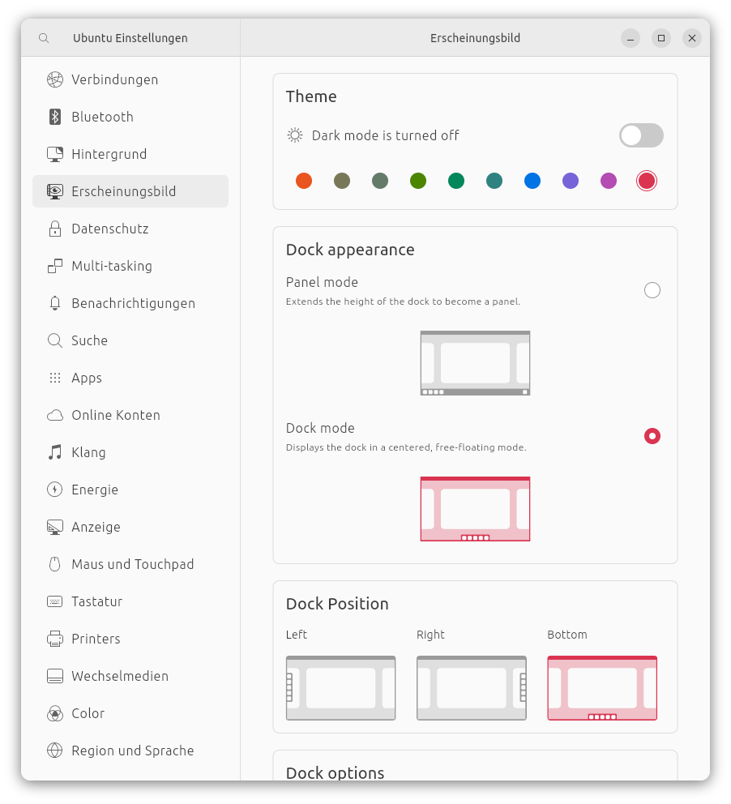
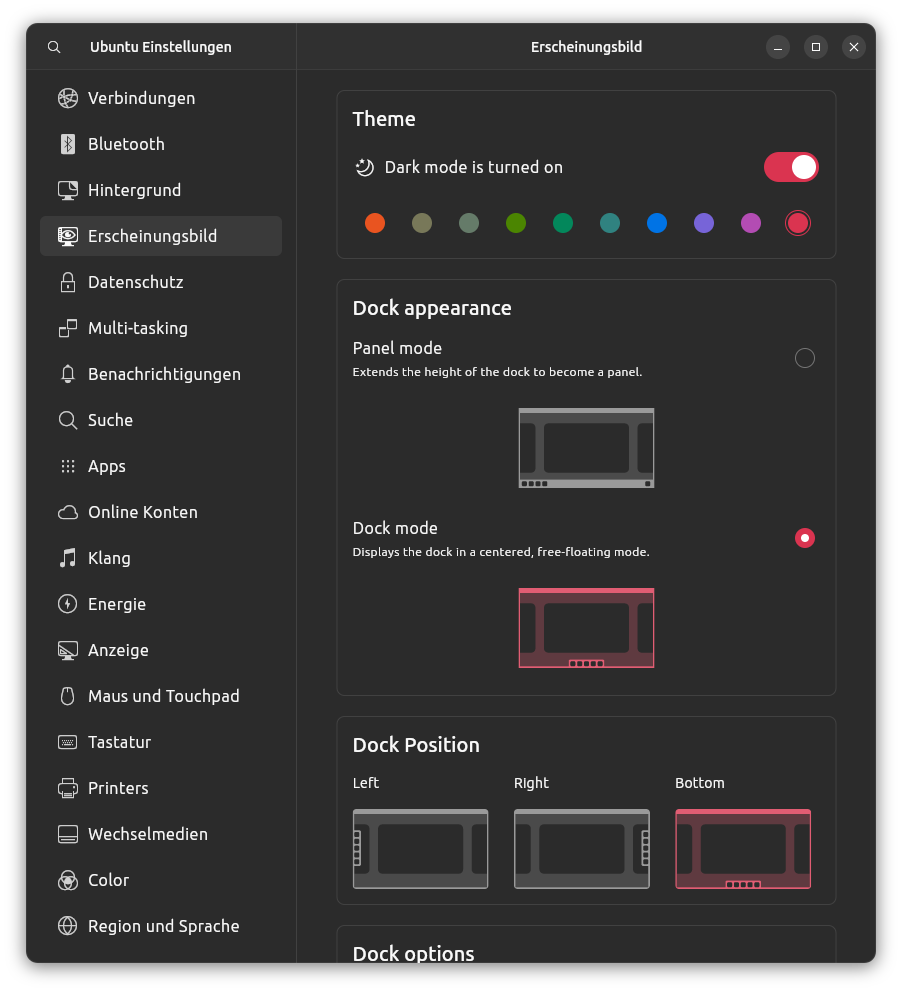

# Settings App for the Ubuntu Desktop

The goal of this project is to build a feature complete settings app for the Ubuntu desktop (GNOME, gtk and gnome-shell) with the Flutter UI toolkit.

| Light | Dark
| - | - |
|  |  |

# Releases

The app will be soon available as a snap.

# Building

The following steps are needed to run the app from the source code.

## Install Flutter

```bash
sudo apt -y install git curl cmake meson make clang libgtk-3-dev pkg-config && mkdir -p ~/development && cd ~/development && git clone https://github.com/flutter/flutter.git -b stable && echo 'export PATH="$PATH:$HOME/development/flutter/bin"' >> ~/.bashrc && source ~/.bashrc
```

##  Run

Run the app with vscode or with
```dart
flutter run
```

# TODO

- [X] use real yaru icons - thanks to @Jupi007
- [X] responsive layout
- [X] [MVVM software pattern](https://en.wikipedia.org/wiki/Model%E2%80%93view%E2%80%93viewmodel) - thanks to @jpnurmi
- [X] search
- [X] WIFI page - WIP
- [ ] Ethernet page
- [ ] Cellular Network page
- [X] Bluetooth page - WIP
- [X] Wallpaper page
- [X] Appearance page
- [X] Multi-Tasking page
- [X] Notifications page
- [ ] Search page
- [X] Apps page (forward to snap-store)
- [X] Privacy/Security page - WIP
- [ ] Online Accounts page
- [ ] Sound page - WIP    
- [X] Power page
- [X] Displays page - WIP
- [X] Mouse and touchpad page
- [X] Keyboard shortcuts page - WIP
- [ ] Printers page - WIP
- [X] Removable Media page    
- [ ] Color page
- [X] Region and language page
- [X] Accessability page
- [ ] Users page
- [ ] Preferred apps page
- [X] Date and time page
- [ ] Wacom page
- [X] Info page

## Contributing

This project really needs help to finish the last pages and also in the future when the GNOME desktop changes. Any help is welcome!
