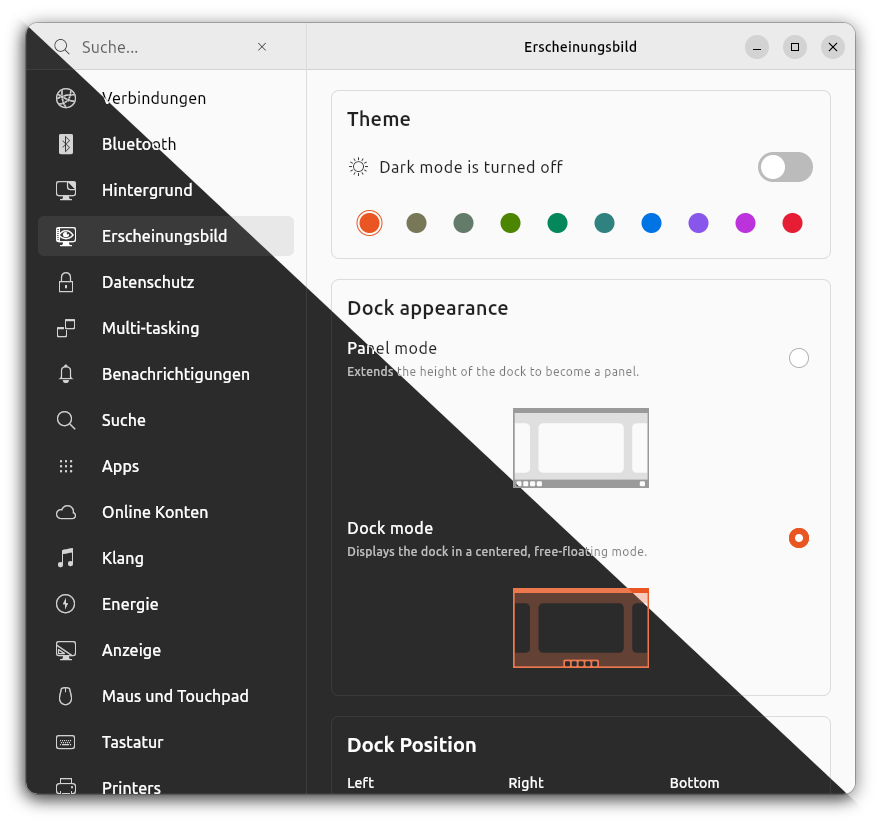

# Unofficial Ubuntu Desktop Settings App made with Flutter - WIP

The goal of this project is to build a feature complete settings app for the Ubuntu desktop with the Flutter UI toolkit.



Mentionable packages that we use and want to thank are:

- [gsettings.dart](https://github.com/canonical/gsettings.dart)
- [bluez.dart](https://github.com/canonical/bluez.dart)
- [nm.dart](https://github.com/canonical/nm.dart)
- [yaru.dart](https://github.com/ubuntu/yaru.dart)
- [yaru_icons.dart](https://github.com/ubuntu/yaru_icons.dart)
- [yaru_widgets.dart](https://github.com/ubuntu/yaru_widgets.dart)
- [dbus.dart](https://github.com/canonical/dbus.dart)
- [upower.dart](https://github.com/canonical/upower.dart)
- [udisks.dart](https://github.com/canonical/udisks.dart)
- [filesystem_picker](https://github.com/andyduke/filesystem_picker)
- [flex_color_picker](https://github.com/rydmike/flex_color_picker)


# Alpha Releases / Download

Currently the app is in a very raw alpha state and pages are still missing.
However if you want you can download, extract and then run alpha releases [from the releases page](https://github.com/Feichtmeier/settings/releases).

# Building

The following steps are needed to run the app from the source code.

## Install Flutter

Either with

```bash
sudo snap install flutter --classic
```

Or with

```bash
sudo apt install git curl cmake meson make clang libgtk-3-dev pkg-config
mkdir ~/development
cd ~/development
git clone https://github.com/flutter/flutter.git -b master
echo 'export PATH="$PATH:$HOME/development/flutter/bin"' >> ~/.bashrc
source ~/.bashrc
```

## Enable flutter linux desktop support

```bash
flutter config --enable-linux-desktop
```

## Install libhandy

```bash
sudo apt install libhandy-1-dev
```

# TODO

- [X] use real yaru icons - thanks to @Jupi007
- [X] responsive layout
- [X] [MVVM software pattern](https://en.wikipedia.org/wiki/Model%E2%80%93view%E2%80%93viewmodel) - thanks to @jpnurmi
- [X] search
- [X] WIFI page - WIP
- [ ] Ethernet page
- [ ] Cellular Network page
- [X] Bluetooth page - WIP
- [X] Wallpaper page
- [X] Appearance page
- [X] Multi-Tasking page
- [X] Notifications page
- [ ] Search page
- [ ] Apps page
- [X] Privacy/Security page - WIP
- [ ] Online Accounts page
- [ ] Sound page - WIP    
- [X] Power page
- [ ] Displays page
- [X] Mouse and touchpad page
- [X] Keyboard shortcuts page - WIP
- [ ] Printers page - WIP
- [X] Removable Media page    
- [ ] Color page
- [ ] Region and language page
- [X] Accessability page
- [ ] Users page
- [ ] Preferred apps page
- [ ] Date and time page
- [ ] Wacom page
- [X] Info page
