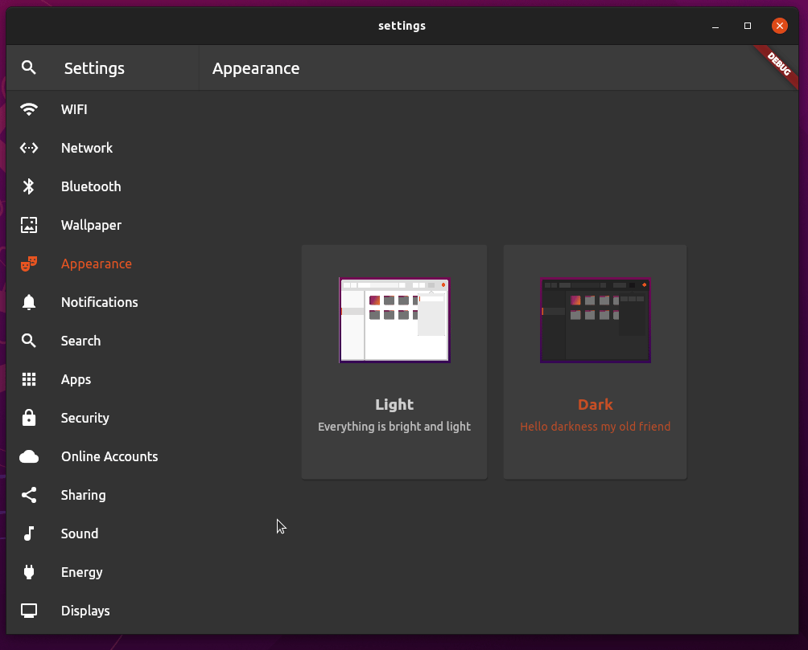

# unofficial Ubuntu Desktop Settings App made with Flutter - WIP

# TODO

- [X] use real yaru icons - thanks to @Jupi007
- [ ] improve layout
- [ ] implement settings search
- [ ] WIFI page
- [ ] Network page
- [ ] Bluetooth page
- [ ] Wallpaper page
- [X] Appearance page
- [X] Notifications page
- [X] Search page
- [ ] Apps page
- [ ] Security page
- [ ] Online Accounts page
- [ ] Sharing page
- [ ] Sound page
- [ ] Energy page
- [ ] Displays page
- [X] Mouse and touchpad page
- [ ] Keyboard shortcuts page - WIP
- [ ] Printers page
- [ ] Shared devices page
- [ ] Color page
- [ ] Region and language page
- [ ] Accessability page
- [ ] Users page
- [ ] Preferred apps page
- [ ] Date and time page
- [ ] Info page
